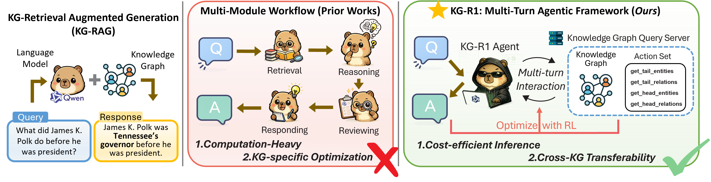
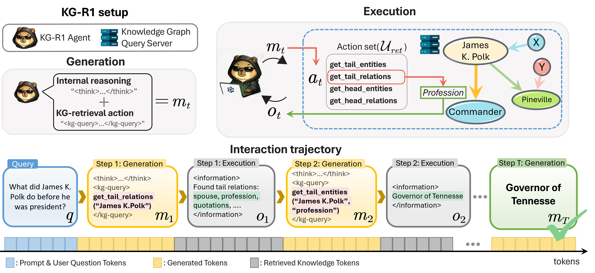

# KG-R1: Efficient and Transferable Agentic Knowledge Graph RAG via Reinforcement Learning

KG-R1 is a reinforcement learning framework for knowledge-graph question answering with a single LLM agent and a lightweight KG retrieval server.

The framework is designed around two goals:
- strong accuracy-efficiency tradeoffs, matching or outperforming multi-module KG-RAG baselines while using a much smaller model
- transferability across knowledge graphs, where the trained policy can be reused without modifying the model and only the KG server adaptation changes

In the experiments accompanying this repository, KG-R1 uses Qwen2.5-3B while several prior works rely on substantially larger models such as Qwen2.5-72B or Qwen3-235B.

This repository focuses on the framework itself: data preparation, KG server setup, training, evaluation, and adapting the system to new knowledge graphs.

<div align="center">
  
  <p><em>Figure 1: KG-R1 single-agent framework vs traditional multi-module KG-RAG workflows</em></p>
</div>

## Multi-Turn KG Reasoning Process

<div align="center">
  
  <p><em>Figure 2: KG-R1 multi-turn interaction trajectory showing iterative knowledge graph exploration</em></p>
</div>

Built upon [veRL](https://github.com/volcengine/verl), KG-R1 supports PPO and GRPO training, multiple LLM backbones, and a schema-agnostic server interface for Freebase-style, Wikidata-style, temporal, and custom knowledge graphs.


## KG-R1 System Architecture

### 1. Single-Agent KG-Augmented Prompt
```
Answer the given question. You can interact with the knowledge graph through the following actions:

- get_tail_relations(entity): Get relations where entity is the subject
- get_head_relations(entity): Get relations where entity is the object  
- get_tail_entities(entity, relation): Get objects for entity-relation pairs
- get_head_entities(entity, relation): Get subjects for relation-entity pairs

Use <search>action_name(arguments)</search> to query the KG. Results appear in <information></information>.
Reason with <think></think> tags. Provide final answer in <answer></answer> tags.

Question: {question}
```

### 2. Knowledge Graph Server Operations
**Base URL**: `http://127.0.0.1:8001/retrieve`

**Core Operations**:
- **get_tail_relations(entity)**: Find all relations where entity is the head/subject
- **get_head_relations(entity)**: Find all relations where entity is the tail/object
- **get_tail_entities(entity, relation)**: Get tail entities for head-relation pairs
- **get_head_entities(entity, relation)**: Get head entities for relation-tail pairs

### 3. Multi-Turn Reasoning Process
KG-R1 enables iterative exploration:
1. **Initial Question Analysis** → Identify key entities
2. **KG Exploration** → Multi-turn relation and entity discovery (up to 5 turns)
3. **Answer Synthesis** → Combine retrieved knowledge for final answer

### 4. LLM-as-Judge Evaluation
Semantic factuality evaluation using GPT-based judge for accurate answer assessment beyond exact string matching.

## Links

- [Installation](#installation)
- [Quick start](#quick-start)
- [Inference](#inference)
- [Use your own dataset](#use-your-own-dataset)
- [Use your own knowledge graph](#use-your-own-knowledge-graph)
- [Features](#features)
- [Acknowledge](#acknowledge)
- [Citations](#citations)

## Installation

### KG-R1 environment
```bash
conda create -n kgr1 python=3.10
conda activate kgr1
# install torch [or you can skip this step and let vllm to install the correct version for you]
pip install torch==2.4.0 --index-url https://download.pytorch.org/whl/cu121
# install vllm
pip3 install vllm==0.6.3 # or you can install 0.5.4, 0.4.2 and 0.3.1

# verl
pip install -e .

# flash attention 2
conda install -c nvidia cuda-toolkit=12.1
pip3 install flash-attn --no-build-isolation
pip install wandb

# Additional dependencies for KG processing
pip install fastapi uvicorn requests aiohttp
pip install networkx # for knowledge graph operations
```

### KG Server environment (required)
The KG-R1 system requires a knowledge graph server for retrieval operations.
```bash
conda create -n kg_server python=3.10
conda activate kg_server

# Core dependencies for KG server
pip install fastapi uvicorn pydantic requests
pip install transformers datasets huggingface_hub
pip install networkx pandas pyarrow

# For efficient KG processing
pip install numpy scipy
```

## Quick start

This section describes the end-to-end setup used to reproduce the CWQ and WebQSP experiments.

### Part 1: Data preparation

**1. Download the datasets**
```bash
bash scripts/setup_data_kg.sh
```

Choose the option that downloads all data in the interactive menu.

**2. Download the Freebase RDF dump**
```bash
wget -O freebase-rdf-latest.gz \
  http://commondatastorage.googleapis.com/freebase-public/rdf/freebase-rdf-latest.gz
```

**3. Process the Freebase entities**
```bash
bash scripts/process_entitites_freebase.sh
```

**4. Convert entity names and ids**
```bash
python scripts/convert_entities.py
```

**5. Build the search-augmented CWQ and WebQSP files**
```bash
python scripts/data_process_kg/cwq_search_augmented_initial_entities.py
python scripts/data_process_kg/webqsp_search_augmented_initial_entities.py
```

After preprocessing, the main evaluation files should be available at:
```text
data_kg/cwq_search_augmented_initial_entities/{train,test}.parquet
data_kg/webqsp_search_augmented_initial_entities/{train,test}.parquet
```

### Part 2: Launch the KG retrieval server

Start the KG server before training or evaluation:
```bash
./kg_retrieval_launch_cwq.sh
```

This serves the retrieval API used by KG-R1 on `http://127.0.0.1:8001/retrieve`.

### Part 3: Training

Train KG-R1 on CWQ with GRPO:
```bash
bash train_grpo_kg_qwen_3b_cwq_f1_turn5.sh
```

The repository also includes related training variants for different turn budgets and datasets.

### Part 4: Evaluation

Once the KG server is running, you can evaluate either a HuggingFace model or a local checkpoint.

#### HuggingFace model evaluation

CWQ example:
```bash
CUDA_VISIBLE_DEVICES=0 bash eval_scripts/kg_r1_eval_main/eval_qwen_3b_turn5_hf.sh \
  your-org/KG-R1-model \
  cwq
```

WebQSP example:
```bash
CUDA_VISIBLE_DEVICES=0 bash eval_scripts/kg_r1_eval_main/eval_qwen_3b_turn5_hf.sh \
  your-org/KG-R1-model \
  webqsp \
  --experiment_postfix=webqsp-main
```

#### Local checkpoint evaluation

CWQ example:
```bash
bash eval_scripts/kg_r1_eval_main/eval_qwen_3b_turn5_local.sh \
  /path/to/checkpoint_root \
  cwq
```

#### Evaluation outputs

Each evaluation run writes:
- Pass@K summary JSON
- Per-example detailed JSONL predictions
- Evaluation logs
- Exact match / F1 metrics

## Inference
#### You can query the trained KG-R1 model on your own questions.

Launch the KG retrieval server:
```bash
./kg_retrieval_launch_cwq.sh
```

Then run inference:
```bash
conda activate kgr1
python infer_kg_r1.py --checkpoint verl_checkpoints/your_trained_model
```
You can modify the `question` parameter to test different knowledge graph questions. The model will interactively explore the KG using the 4 basic operations and provide reasoning traces.

## Use your own dataset

### KG-QA data format
For each knowledge graph question-answer sample, it should be a dictionary containing:

```python
data = {
    "data_source": "your_kg_dataset",
    "original_query": question,
    "target_text": answer,
    "query_entities": ["entity1", "entity2"],  # Initial entities
    "query_id": unique_id,
    "split": "train/test/dev"
}
```

### Knowledge Graph format
Your knowledge graph should provide the following structure:

```python
# Entity-relation-entity triples
kg_data = {
    "entities": {"entity_id": "human_readable_name"},
    "relations": {"relation_id": "human_readable_name"},
    "triples": [
        ["head_entity_id", "relation_id", "tail_entity_id"],
        # ... more triples
    ]
}
```

You can refer to `scripts/data_kg/process_datasets.py` for concrete data processing examples for CWQ and WebQSP datasets.

### Knowledge Graph Server Setup

To use your own knowledge graph, you need to set up the KG server with your data:

1. **Prepare your KG data** in the required format (see above)
2. **Start the KG server** with your data directory:

```bash
# Your KG data should be organized as:
# your_kg_data/
# ├── entities.json
# ├── relations.json  
# ├── train_simple.json
# └── test_simple.json

python kg_r1/search/server.py --port 8001 --data_dir your_kg_data
```

3. **Configure your training script** to point to your KG server:

```bash
# In your training script, update:
actor_rollout_ref.rollout.search.search_url="http://127.0.0.1:8001/retrieve"
```

The KG server supports the 4 basic operations:
- `get_tail_relations(entity)`: Find relations where entity is the subject
- `get_head_relations(entity)`: Find relations where entity is the object
- `get_tail_entities(entity, relation)`: Get tail entities for head-relation pairs
- `get_head_entities(entity, relation)`: Get head entities for relation-tail pairs

## Use your own knowledge graph

KG-R1 supports different types of knowledge graphs with a schema-agnostic design. The system works with:
- **Freebase-style KGs**: Entity-centric with rich relations
- **Wikidata KGs**: Property-based knowledge representation
- **Temporal KGs**: Time-aware knowledge graphs
- **Domain-specific KGs**: Custom knowledge graphs for specific domains

The main philosophy is to launch a KG server separately from the RL training pipeline, providing a clean API interface.

The LLM agent calls the KG server through the search API at `http://127.0.0.1:8001/retrieve`.

### KG Server Implementation
You can refer to `kg_r1/search/server.py` for the complete KG server implementation, which includes:
- **FastAPI server**: RESTful API for KG operations
- **Concurrent processing**: ThreadPoolExecutor for handling multiple requests
- **Action routing**: Dispatches requests to appropriate KG operations
- **Error handling**: Robust error handling for malformed queries

### Cross-KG Transfer
KG-R1's key advantage is cross-KG transferability. Models trained on one KG can transfer to different KG schemas without retraining, enabling plug-and-play usage.

## Citations

If you use KG-R1 in your research, citation information will be provided upon publication.
